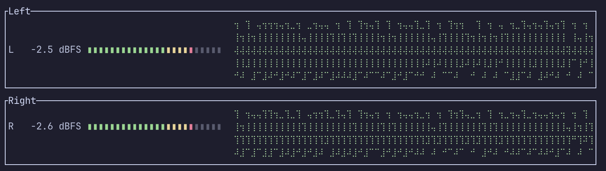

# meter

`meter` is a terminal audio meter + oscilloscope for macOS loopback devices.

It is designed for tmux panes and live monitoring while you work.



## Features

- Stereo peak meter with ballistic envelope
  - Attack: 1 ms
  - Release: 200 ms
- LED-style meter scale
  - Linear from -60 dBFS to +12 dBFS
  - 24 segments
  - Green / Yellow / Red threshold bands
- Per-channel scrolling oscilloscope (min/max bucketed)
- Passthrough to your default output is enabled by default
- Realtime-safe audio callbacks (no locks/allocations in the hot path)
- `meter` command auto-builds release binary when sources change

## Requirements

- macOS
- Rust toolchain (`cargo`)
- A loopback input device (for example, Loopback or BlackHole)

## Install

```bash
./scripts/install.sh
```

## Quick Start

```bash
meter
```

## Usage

```bash
meter [input-device-name] [--no-passthrough]
```

Examples:

```bash
meter
meter music_out
meter ABLETON
meter ABLETON --no-passthrough
```

List input devices:

```bash
cargo run --release -- --list-devices
```

Quit with `q` or `Esc`.

## Loopback Setup (Rogue Amoeba)

1. Create a virtual device in Loopback, for example `music_out` or `ABLETON`.
2. Add your source(s) to that virtual device:
   - For system audio, add a system/device source.
   - For app-specific routing, add the app source (for example Ableton Live).
3. Route the app/system output to that Loopback virtual device.
4. Run meter with the same device name:

```bash
meter music_out
# or
meter ABLETON
```

5. To disable app passthrough and meter only:

```bash
meter music_out --no-passthrough
```

## Notes

- `meter` auto-builds on first run and when source files change.
- If your shell cannot find `meter`, reload your shell config (`source ~/.zshrc`) or open a new terminal.

## License

MIT. See [LICENSE](LICENSE).
